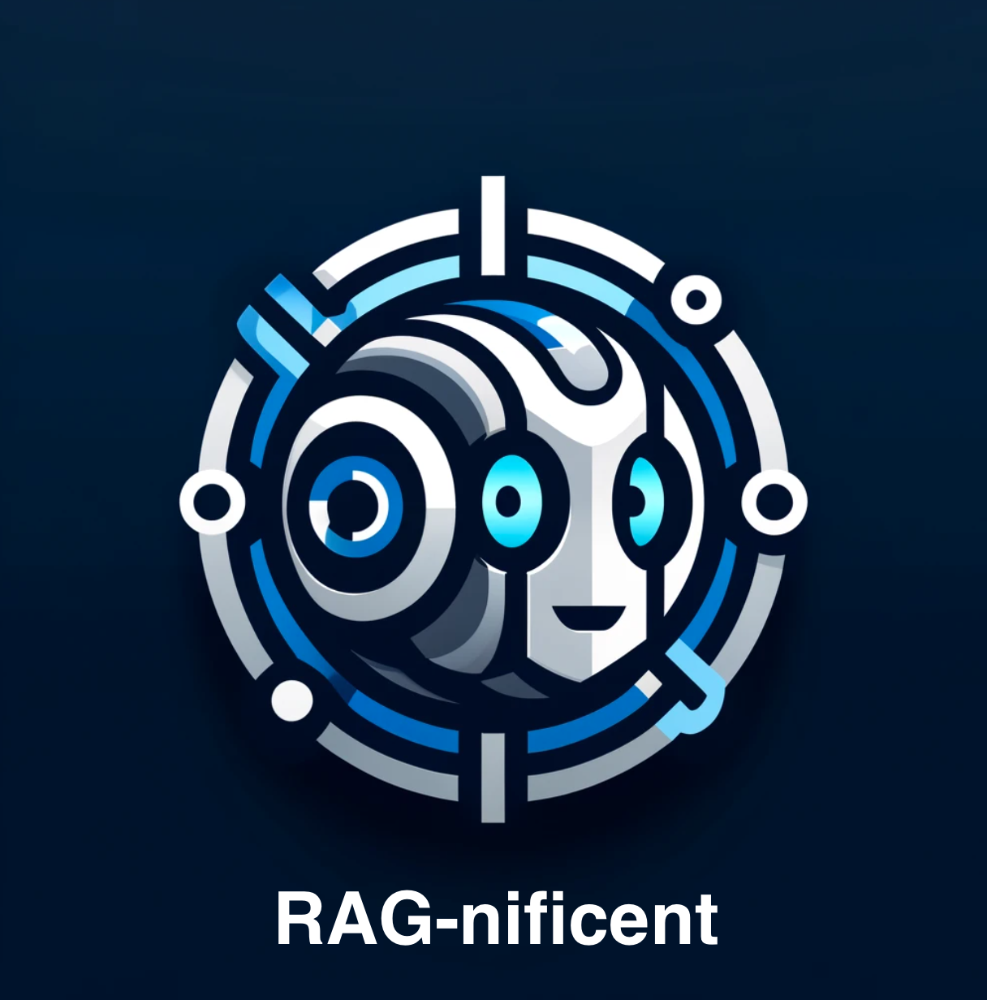

# RAG-nificent: Real-time Accessible PDFs, Reports, and Guidelines
<p align="center">
  
</p>
RAG-nificent is a state-of-the-art repository that leverages the power of Retrieval-Augmented Generation (RAG) to provide instant answers and references from a curated directory of PDFs containing UN guidelines and other regulatory documents. This system is designed to aid researchers, policy makers, and the public in quickly finding specific information within extensive documents.

## Features

- **Conversational Interface**: Engage with the system using natural language queries to receive responses directly sourced from the PDFs.
- **Direct Citation**: Every response from the system includes a direct link to the source PDF page, ensuring traceability and verification.
- **PDF Directory**: A predefined set of key PDF documents, currently including UN guidelines on major health topics such as schistosomiasis and malaria.

## Demo


## How It Works

The application utilizes a combination of OpenAI embeddings, Pinecone vector search, and a conversational interface to provide a seamless retrieval experience. When a query is made, the system:

1. Converts the query into embeddings.
2. Searches for the most relevant document sections using Pinecone's vector search.
3. Returns the answer along with citations and links to the source documents.

## Setup

1. Clone the repository:
   ```bash
   git clone https://github.com/yourusername/RAG-nificent.git
   ```
2. Install dependencies:
   ```bash
   pip install -r requirements.txt
   ```
3. Set environment variables in a `.env` (also see `.env.example`file:
   - `PINECONE_INDEX_NAME`
   - `PINECONE_NAME_SPACE`
   - `OPENAI_API_KEY`
   - `PINECONE_API_KEY`

4. Create a [Pinecone](pinecone.io) index with the same name as  `PINECONE_INDEX_NAME`. Set it up with `dimensions=1536` and `metric=cosine`.
5. Place your PDFs in the `pdf_data` directory and run `data_ingestion.py`
6. Run the application:
   ```bash
   chainlit run app.py
   ```

## Source Documents

The system currently includes guidelines from the following PDFs with direct links to the documents:

- [WHO guideline on control and elimination of human schistosomiasis (2022)](https://iris.who.int/bitstream/handle/10665/351856/9789240041608-eng.pdf)
- [WHO guidelines for malaria (2023)](https://iris.who.int/bitstream/handle/10665/373339/WHO-UCN-GMP-2023.01-Rev.1-eng.pdf)


## License

This project is licensed under the MIT License.

